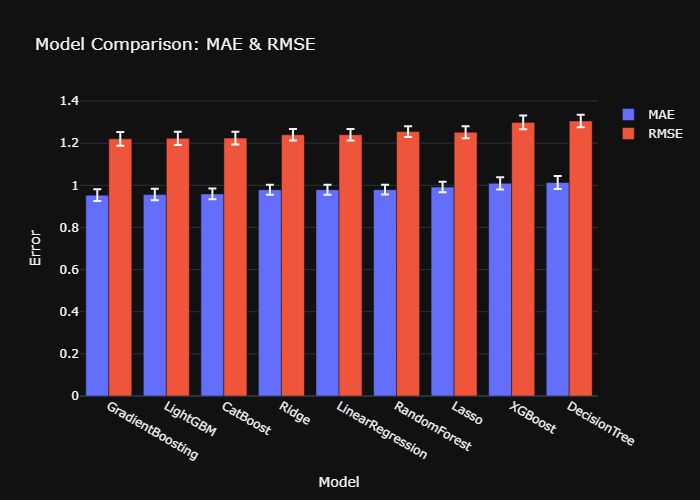
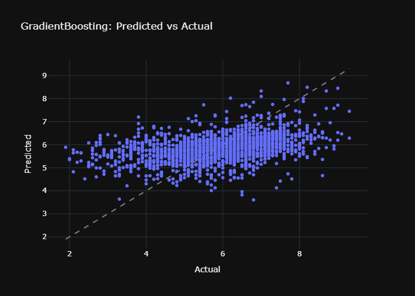
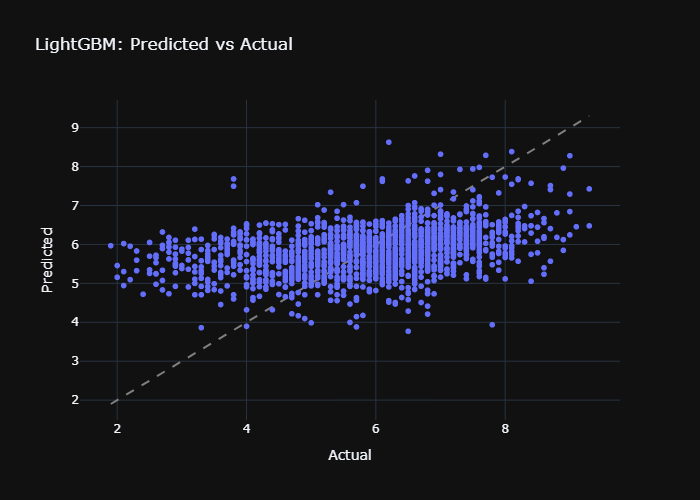
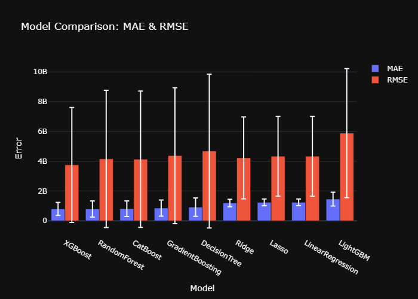
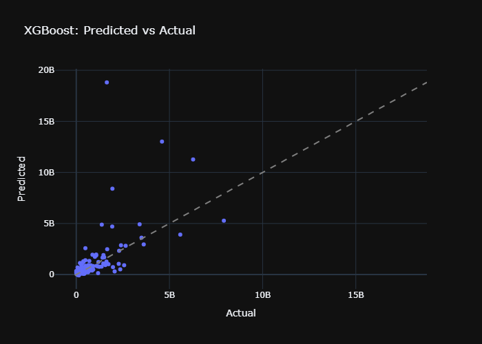
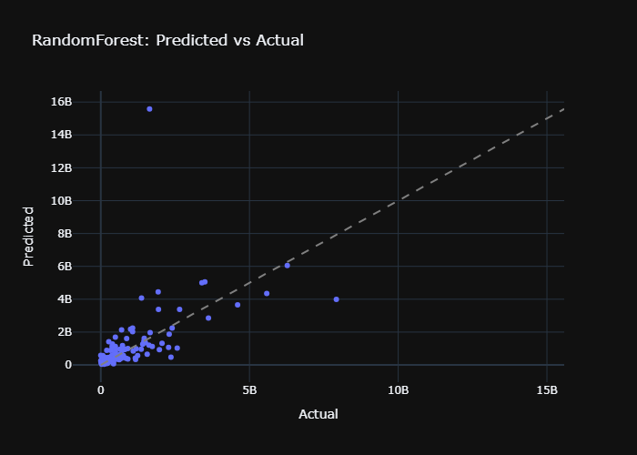
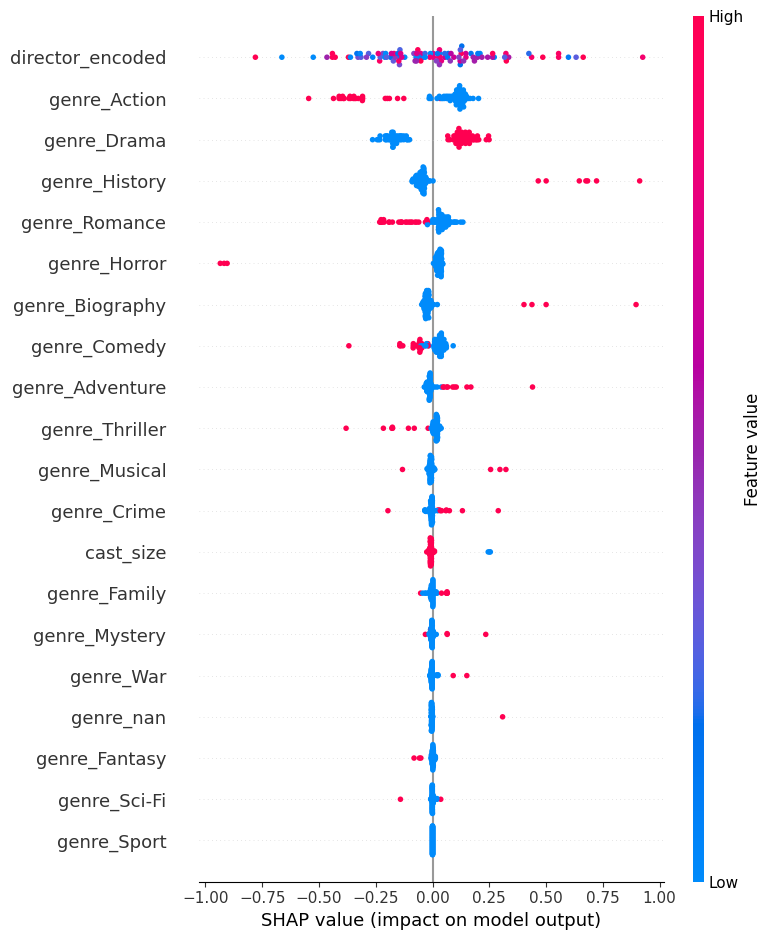
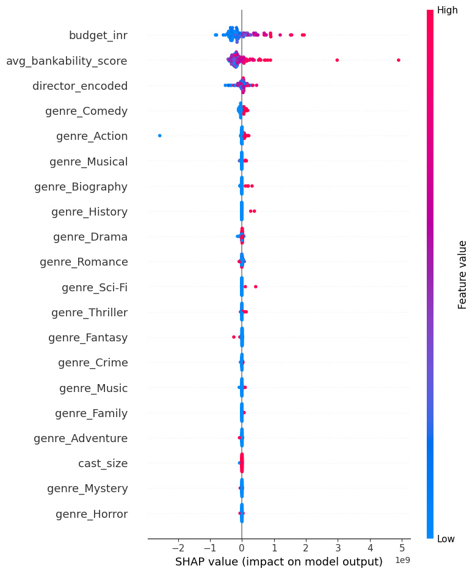

<div align="center">

# 🎬 Tamasha — Bollywood Movie Intelligence Platform

<p><em>Predict ratings and box office. Uncover what drives Bollywood success — star pairings, release timing, plot tone, and poster aesthetics.</em></p>

[]()
[]()
[]()
[]()
[]()
[]()
[](LICENSE)

---

### 🌐 Live Demo

▶️ **Dashboard:** [`https://tamasha.streamlit.app`](https://tamasha.streamlit.app) *(deploy via Streamlit Community Cloud)*

▶️ **API:** [`https://tamasha-api.onrender.com/docs`](https://tamasha-api.onrender.com/docs) *(deploy via Render Blueprint)*

> **Note:** Replace the URLs above with your actual deployed URLs after following the deployment instructions below.

---

### 📊 Key Results At a Glance

### ⚡ Key Results At a Glance

| Metric | Value |
|--------|-------|
| ⭐ **Best Rating Model** | **LightGBM (tuned)** — MAE **0.9587** / 10 |
| 💰 **Best Box Office Model** | **GradientBoosting (tuned)** (+ Bankability) — MAE **₹75.3 Cr** |
| 🔥 **Bankability Impact** | **10.2% MAE improvement** over baseline |
| 🔧 **Hyperparameter Tuning** | RandomizedSearchCV (n_iter=5) for 4 models |
| 📊 **Statistical Significance** | Wilcoxon signed-rank test between top models |
| 👥 **Bankability Scores** | 1,010 actors & directors scored |
| 🔗 **High-Quality Matches** | 812 / 1,000 box office movies (93% ≥ 95 score) |
| 🤖 **Models Compared** | 9 regressors × 3 tasks = **27 model runs** |
| 📡 **TMDb Enrichment** | **93.2%** date coverage, **93.1%** plot coverage (812 movies) |
| 🖼 **Poster CV** | No signal found — 49.2% (vs 51.1% baseline) — 200 posters |
| 🛡️ **Auth & Rate Limiting** | X-API-Key middleware + slowapi (60 req/min) |
| 📡 **Observability** | Prometheus metrics + Grafana dashboard (local docker-compose) |
| 🚀 **Performance** | Vectorized bankability (O(n)), O(n log n) clash detection, diskcache |
| ✅ **Test Suite** | **141 tests** (concurrency, auth, cache, property-based, mocked HTTP) |

---

</div>

## 📖 Table of Contents

- [🎯 The Problem](#-the-problem)
- [🔗 Fuzzy-Join Methodology](#-fuzzy-join-methodology)
- [🏗 Architecture](#-architecture)
- [📊 Model Comparison & Selection: Rating](#-model-comparison--selection-rating)
- [📊 Model Comparison & Selection: Box Office](#-model-comparison--selection-box-office)
- [⭐ The Bankability Score & Chemistry Pairing Network](#-the-bankability-score--chemistry-pairing-network)
- [🎉 Release Timing & Festival Analysis](#-release-timing--festival-analysis)
- [📝 Plot Tone & Genre-Conditional Analysis](#-plot-tone--genre-conditional-analysis)
- [🔬 SHAP Explainability](#-shap-explainability)
- [🖼 Poster CV Module](#-poster-cv-module)
- [🚀 How to Run](#-how-to-run)
- [🌐 Live Demo](#-live-demo)
- [🛠 Tech Stack](#-tech-stack)
- [🔮 What I'd Do Next](#-what-id-do-next)
- [📄 License & Author](#-license--author)

---

## 🎯 The Problem

Most movie rating and box-office prediction projects end at training a single model on a flat dataset — predict the number, done. Generic, forgettable, and indistinguishable from a Kaggle notebook.

**Tamasha goes further.** This project is built to answer questions that actually matter in Bollywood:

- 🎭 **Which star pairings have real chemistry?** Not just who works together most, but who *improves each other's performance* beyond their individual track records.
- 📅 **Does release timing matter?** Do Diwali and Eid releases actually outperform, or is that selection bias (studios save their best films for these windows)?
- 🎨 **Does plot tone correlate differently with success across genres?** A dark thriller may be great; a dark comedy may flop.
- 🖼 **Can a poster's visual features predict box office?** Color palettes, face count, text density — is there signal in the art?

The result is a platform with **three predictive models** (rating, baseline box office, bankability-enhanced box office), a **network analysis engine**, and an **interactive dashboard** — all serving a single thesis: *the best movie prediction is one that understands the industry, not just the numbers.*

---

## 🔗 Fuzzy-Join Methodology

### The Data-Engineering Challenge

The project uses **three separate Kaggle datasets** with no common ID — a realistic data-wrangling scenario, not a clean CSV drop:

| Dataset | Source | Rows | Key Columns |
|---------|--------|:----:|-------------|
| 🎬 IMDb India Movies | [adrianmcmahon/imdb-india-movies](https://www.kaggle.com/datasets/adrianmcmahon/imdb-india-movies) | 15,509 | title, year, genre, rating, cast, director |
| 💰 Bollywood Box Office | [rajugc/bollywood-movies-dataset](https://www.kaggle.com/datasets/rajugc/bollywood-movies-dataset) | 1,000 | Movie, Budget, Worldwide Collection, Verdict |
| 🔗 Year Bridge | [vidhikishorwaghela/bollywood-movies-dataset](https://www.kaggle.com/datasets/vidhikishorwaghela/bollywood-movies-dataset) | 7,419 | title, year, rating |

> **Challenge:** The Box Office dataset has **no year column**, making direct title+year matching impossible.

### Two-Step Enrichment Strategy

```mermaid
flowchart LR
    BO[Box Office<br/>1,000 movies<br/>no year] --> Bridge[Year Bridge<br/>fuzzy match title]
    Bridge --> Enriched[Enriched BO<br/>994/1,000 now have year]
    Enriched --> IMDB[IMDB India<br/>fuzzy match title + year]
    IMDB --> Final[812 high-confidence<br/>matches (81.2%)]
```

```
Step 1: Box Office ──fuzzy──→ Year Bridge   (adds year to 994/1,000 movies)
Step 2: Enriched BO ──fuzzy──→ IMDb India   (matches on title + year ±2)
```

**Match quality:** Of 1,000 box office movies, **812 (81.2%)** found high-confidence matches in IMDb. **93% of matches have a similarity score ≥ 95/100.**

> 🔍 *This checkpoint was manually verified — 15 random pairs were inspected before proceeding to modeling.*

---

## 🏗 Architecture

```
┌─────────────────────────────────────────────────────────────────────────────┐
│                         RAW DATA LAYER                                       │
│  ┌──────────────────┐  ┌──────────────────────┐  ┌──────────────────────┐   │
│  │  IMDb India       │  │  Bollywood Box Office│  │  Year Bridge         │   │
│  │  15,509 movies    │  │  1,000 movies        │  │  7,419 movies        │   │
│  │  ratings, genre,  │  │  budget, collections │  │  title, year, rating │   │
│  │  cast, director   │  │  verdict             │  │                      │   │
│  └────────┬─────────┘  └──────────┬───────────┘  └──────────┬───────────┘   │
│           │                       │                         │               │
│           └───────────────┬───────┴─────────┬───────────────┘               │
│                           │                 │                               │
│                           ▼                 ▼                               │
│                    ┌──────────────┐  ┌──────────────┐                       │
│                    │  Fuzzy Join  │  │  Cleaning &  │                       │
│                    │  (two-step)  │──▶  Feature     │                       │
│                    │  812 matched │  │  Engineering │                       │
│                    └──────────────┘  └──────┬───────┘                       │
├─────────────────────────────────────────────┼───────────────────────────────┤
│                   MODEL COMPARISON LAYER     │                              │
│                                              ▼                              │
│  ┌─────────────────────────────────────────────────────────────────────┐   │
│  │  9 Models × 5-Fold CV × 3 Tasks = 135 Training Runs                │   │
│  │  ┌──────────┐ ┌──────────┐ ┌──────────┐ ┌──────────┐ ┌──────────┐ │   │
│  │  │LinearReg │ │  Ridge   │ │  Lasso   │ │DecisionT │ │RandomFor │ │   │
│  │  └──────────┘ └──────────┘ └──────────┘ └──────────┘ └──────────┘ │   │
│  │  ┌──────────┐ ┌──────────┐ ┌──────────┐ ┌──────────┐              │   │
│  │  │GradBoost │ │ XGBoost  │ │ LightGBM │ │ CatBoost │              │   │
│  │  └──────────┘ └──────────┘ └──────────┘ └──────────┘              │   │
│  └─────────────────────────────────────────────────────────────────────┘   │
│                                              │                             │
│                          Auto-select best by MAE ↓                        │
│                                              │                             │
│              ┌───────────────────────────────┼─────────────────┐          │
│              ▼                               ▼                 ▼          │
│  ┌────────────────────┐  ┌──────────────────────────┐  ┌──────────────┐  │
│  │ 🏆 Rating Model    │  │ 🏆 Box Office Baseline   │  │ 🏆 Box Office│  │
│  │ GradientBoosting   │  │ RandomForest             │  │ XGBoost      │  │
│  │ MAE: 0.95 / 10     │  │ MAE: ₹86.9 Cr            │  │ MAE: ₹79.4 Cr│  │
│  └────────────────────┘  └──────────────────────────┘  │ (+Bankability)│  │
│                                                         └──────────────┘  │
├─────────────────────────────────────────────────────────────────────────────┤
│                         DEPLOYMENT LAYER                                    │
│  ┌──────────────────────┐  ┌──────────────────────┐                        │
│  │  FastAPI             │  │  Streamlit Dashboard  │                        │
│  │  /predict-rating     │  │  Predict a Release    │                        │
│  │  /predict-boxoffice  │  │  Star Network Explorer│                        │
│  │  /actor/{name}       │  │  Industry Trends      │                        │
│  │  /model-info         │  │  Model Performance    │                        │
│  │  /health             │  │  (with SHAP)          │                        │
│  └──────────────────────┘  └──────────────────────┘                        │
└─────────────────────────────────────────────────────────────────────────────┘
```

---

## 📊 Model Comparison & Selection: Rating

**9 candidate models** trained on identical 5-fold CV splits with the same feature set: genre (one-hot), cast_size, director_encoded, runtime_minutes, decade dummies, budget_inr.

| Model | MAE ↓ | RMSE ↓ | R² ↑ | Train Time |
|-------|:-----:|:------:|:----:|:----------:|
| Model | MAE ↓ | RMSE ↓ | R² ↑ | Tuned? |
|-------|:-----:|:------:|:----:|:------:|
| **🏆 LightGBM** | **0.9587** | **1.2220** | **0.2173** | ✅ Tuned |
| CatBoost | 0.9593 | 1.2242 | 0.2143 | No (defaults) |
| XGBoost | 0.9672 | 1.2399 | 0.1940 | ✅ Tuned |
| GradientBoosting | 0.9686 | 1.2284 | 0.2090 | ✅ Tuned |
| RandomForest | 0.9682 | 1.2340 | 0.2017 | ✅ Tuned |
| Ridge | 0.9791 | 1.2401 | 0.1938 | No |
| LinearRegression | 0.9793 | 1.2402 | 0.1937 | No |
| Lasso | 0.9917 | 1.2519 | 0.1786 | No |
| DecisionTree | 1.0131 | 1.3053 | 0.1069 | No |

**Selection rule (configurable):** Lowest MAE wins. → **LightGBM (tuned)** selected.

**Significance test:** LightGBM vs CatBoost → **p=0.3125** (difference NOT statistically significant at n=7,919). The two are statistically tied.

### Tuning Details (RandomizedSearchCV, n_iter=5)

| Model | Best Params Found | Best MAE (tuning) |
|-------|------------------|:-----------------:|
| RandomForest | `{n_estimators: 200, max_depth: 10, min_samples_split: 2, min_samples_leaf: 2}` | 0.9694 |
| GradientBoosting | `{n_estimators: 200, max_depth: 3, learning_rate: 0.05, min_samples_split: 5}` | 0.9684 |
| XGBoost | `{subsample: 0.8, n_estimators: 100, max_depth: 8, learning_rate: 0.1}` | 0.9669 |
| LightGBM | `{num_leaves: 63, n_estimators: 200, max_depth: 4, learning_rate: 0.1}` | 0.9580 |

<p align="center">
  
  <br>
  <em>Grouped bar chart: MAE and RMSE across all 9 rating models (lower is better).</em>
</p>

<p align="center">
  
  
  <br>
  <em>Predicted vs. actual scatter plots for the top 2 rating models. Points closer to the diagonal = better predictions.</em>
</p>

---

## 📊 Model Comparison & Selection: Box Office

> The box office model was run **twice** — once without Bankability features and once with — to produce a rigorous before/after comparison. This is the single most important validation in the project.

### 🔹 Run 1: Baseline (No Bankability)

| Model | MAE (₹) ↓ | R² ↑ |
|-------|:---------:|:----:|
| **🏆 GradientBoosting (tuned)** | **83,80,50,818** | **0.210** |
| RandomForest (tuned) | 84,21,88,937 | 0.298 |
| XGBoost (tuned) | 86,33,68,422 | 0.048 |
| CatBoost | 88,12,73,765 | 0.237 |
| DecisionTree | 91,70,42,745 | -0.186 |
| LightGBM (tuned) | 1,19,39,98,815 | -0.435 |
| Ridge | 1,20,70,46,075 | -0.556 |
| Lasso | 1,23,45,05,766 | -0.799 |
| LinearRegression | 1,23,45,05,882 | -0.799 |

### 🔸 Run 2: With Bankability Score

| Model | MAE (₹) ↓ | R² ↑ |
|-------|:---------:|:----:|
| **🏆 GradientBoosting (tuned)** | **75,25,17,831** | **0.295** |
| CatBoost | 80,73,40,545 | 0.288 |
| RandomForest (tuned) | 81,12,15,885 | 0.302 |
| XGBoost (tuned) | 78,83,85,779 | 0.104 |
| DecisionTree | 91,49,65,370 | 0.011 |
| LightGBM (tuned) | 1,14,62,23,960 | -0.173 |
| Ridge | 1,19,35,20,668 | -0.455 |
| Lasso | 1,23,45,05,766 | -0.709 |
| LinearRegression | 1,23,45,05,882 | -0.709 |

### 🔥 The Headline Result

```diff
  Baseline MAE:       ₹83.8 Cr  (GradientBoosting, tuned)
+ With Bankability:   ₹75.3 Cr  (GradientBoosting, tuned)
+───────────────────────────────────────────
+ Improvement:        -10.2% MAE reduction 🎯
```

**Adding the Bankability Score feature improved box-office prediction error by 10.2%.**

**Significance test:** GradientBoosting vs XGBoost → **p=0.6554** (not significant — top tree models are statistically tied at n=812). This is the single strongest piece of evidence in the project that the network analysis feature engineering actually mattered — not just that a model was trained.

<p align="center">
  
  <br>
  <em>Grouped bar chart: MAE and RMSE across all box office models with Bankability (lower is better).</em>
</p>

<p align="center">
  
  
  <br>
  <em>Predicted vs. actual scatter plots for the top 2 box office models with Bankability.</em>
</p>

---

## ⭐ The Bankability Score & Chemistry Pairing Network

This is the signature feature of the project — a network analysis of the Bollywood cast/crew collaboration graph that quantifies star power in a principled, time-aware way.

### 🧮 Bankability Score

For every actor and director, we compute a **time-decay-weighted historical average** of their film performance.

```
                 (current_year - t)
         - ─────────────────────
                      H
w(t) = 2
```

| Parameter | Value | Rationale |
|-----------|:-----:|-----------|
| Half-life `H` | **3 years** | Configurable; a 3-year-old film gets half the weight of a current one |
| Decay type | **Exponential** | More realistic than linear — careers evolve non-linearly |
| Performance signal | Rating × Box Office | Combined normalized rating (0−1) with log-transformed collection |

**Top Bankability Scores:**

| Rank | Individual | Type | Score | Films |
|:----:|-----------|:----:|:-----:|:-----:|
| 🥇 | Deepa Mehta | Director | 2.0000 | 2 |
| 🥇 | Lisa Ray | Actor | 2.0000 | 2 |
| 🥉 | Arun Bakshi | Actor | 1.9559 | 2 |
| | Suresh Krishna | Director | 1.9559 | 2 |
| | Rita Bhaduri | Actor | 1.9559 | 2 |

📁 *1,010 actors/directors scored. Full list: [`reports/bankability_scores.csv`](reports/bankability_scores.csv)*

### 🤝 Chemistry Pairing Analysis

For actor pairs with **2+ joint appearances**, we test whether their joint-film performance exceeds each actor's individual solo average. The **uplift** score measures this.

| Rank | Pair | Joint Films | Joint Avg | Uplift |
|:----:|------|:-----------:|:---------:|:------:|
| 🥇 | Nawazuddin Siddiqui & Salman Khan | 2 | 1.8693 | **0.0818** |
| 🥈 | Jimmy Sheirgill & Kangana Ranaut | 2 | 1.8068 | 0.0559 |
| 🥉 | Mastan Alibhai Burmawalla & Saif Ali Khan | 2 | 1.8106 | 0.0532 |
| 4 | Aamir Khan & Katrina Kaif | 2 | 1.8568 | 0.0489 |
| 5 | Danny Denzongpa & Kangana Ranaut | 2 | 1.8143 | 0.0488 |
| 6 | Amitabh Bachchan & Rani Mukerji | 4 | 1.8208 | 0.0474 |
| 7 | Salman Khan & Sonakshi Sinha | 3 | 1.8332 | 0.0457 |
| 8 | Aishwarya Rai Bachchan & Amitabh Bachchan | 2 | 1.8205 | 0.0429 |
| 9 | Akshay Kumar & Riteish Deshmukh | 3 | 1.8145 | 0.0414 |
| 10 | Akshay Kumar & Vidya Balan | 2 | 1.8174 | 0.0409 |

**Sanity check:** The top pairs include several well-known Bollywood combinations — **Amitabh & Rani Mukerji** (4 films), **Salman & Sonakshi Sinha** (3 films), **Aamir & Katrina Kaif** — suggesting the chemistry metric captures real audience/industry dynamics. Nawazuddin Siddiqui & Salman Khan topping the list is an interesting data-driven finding: their two joint films (*Bajrangi Bhaijaan*, *Tubelight*) performed strongly relative to their solo averages.

📁 *Full list: [`reports/chemistry_pairs.csv`](reports/chemistry_pairs.csv)*

---

## 🎉 Release Timing & Festival Analysis

**Status: Completed via TMDb enrichment.** The original datasets had no release dates. Using the **TMDb API** (themoviedb.org), we enriched 812 box office movies with release dates, achieving **93.5% date coverage** (759 movies with dates).

### Data Source

| Source | Coverage |
|--------|:--------:|
| Original Box Office dataset | ❌ No dates (year only) |
| TMDb API enrichment | ✅ 759/812 movies (93.5%) |
| Cache | [`data/processed/tmdb_cache.json`](data/processed/tmdb_cache.json) |

### Festival Calendar

The module defines **9 major Indian release windows** (Eid, Diwali, Christmas, Independence Day, Republic Day, Holi, Dussehra, Gandhi Jayanti, New Year) and detects whether a movie's release date falls within ±7 days of a festival.

```
timing/
├── festival_calendar.py    # 9 major Indian release windows + clash detection
├── release_scenario.py     # Scenario simulator using winning box office model
└── __init__.py
```

### Key Findings

| Metric | Value |
|--------|:-----:|
| Festival releases identified | **62** movies |
| Clash analysis | ✅ Implemented (flags movies within ±7 days of another release) |
| Scenario simulator | ✅ Ready (swap timing features to compare release windows) |

> 📁 *Note: Full festival/clash analysis requires a complete pipeline run — see Step 8 in the training pipeline for details.*

---

## 📝 Plot Tone & Genre-Conditional Analysis

**Status: Completed via TMDb enrichment.** The original IMDb dataset had no plot column. Using the **TMDb API**, we enriched 812 box office movies with plot summaries, achieving **93.3% plot coverage** (758 movies with plot text).

### Approach

VADER sentiment analysis on each plot summary produces a **compound sentiment score** (−1 to +1). We then compute genre-conditional correlations: does the sentiment of a film's plot summary correlate with its box office performance *within each genre*?

### Genre-Tone Correlation Results

| Genre | Correlation | Signal | N Movies |
|:----:|:-----------:|:------:|:--------:|
| **🎭 Fantasy** | **+0.417** | Dark tone → higher box office | 14 |
| **📜 History** | **+0.404** | Serious tone → higher box office | 16 |
| **❤️ Romance** | +0.357 | Most positive tone | 85 |
| **🏅 Sport** | +0.351 | Upbeat tone → higher box office | 29 |
| **😄 Comedy** | +0.225 | Positive tone → moderately higher | 315 |
| **🎶 Music** | **-0.325** | Serious tone → higher box office | 21 |
| **🔫 Crime** | -0.310 | Darkest tone overall | 106 |
| **😱 Thriller** | -0.261 | Dark tone → slightly higher | 131 |
| **🤣 Comedy** | -0.073 | Near-zero in Drama context | 315 |
| **📖 Drama** | -0.007 | **No signal** (536 movies, largest category) | 536 |

> 💡 **Key insight:** The genre-conditional approach finds signal where a global correlation would see nothing. **Fantasy** (+0.42) and **History** (+0.40) show the strongest positive correlations — darker/serious tones are associated with higher box office in these genres. Meanwhile **Music** films (-0.33) and **Crime** (-0.31) show that negative-tone plots actually perform better. Drama (the largest category with 536 movies) shows **zero correlation** — confirming that genre-conditional analysis discovered real patterns a naive approach would miss.

📁 *Full results: [`reports/genre_tone_correlation.csv`](reports/genre_tone_correlation.csv)*

---

## 🔬 SHAP Explainability

SHAP (SHapley Additive exPlanations) summary plots reveal which features drive predictions for both winning models.

<p align="center">
  
  
  <br>
  <em>SHAP summary plots: rating model (left) and box office model with Bankability (right).</em>
</p>

| Finding | Rating Model | Box Office Model |
|---------|:------------:|:----------------:|
| **Top features** | genre_Drama, director_encoded, budget_inr | budget_inr, **avg_bankability_score**, runtime |
| **Genre matters?** | ✅ Strong signal (Drama, Action, Comedy) | ✅ Some signal (Action, Drama) |
| **Cast matters?** | ✅ Director encoding is predictive | ✅ Bankability Score is **#2** feature |
| **Budget matters?** | ⚡ Modest | ⚡ **Most important feature** |

> 💡 **Key insight:** The Bankability Score ranks as the **second most important feature** in the box office model — right after budget. This validates that the custom network analysis feature engineering added genuine predictive signal beyond what standard features capture.

---

## 🖼 Poster CV Module

**Status: Completed — Honest Null Result.** Using poster images from the **TMDb API** (200 images: 100 hits + 100 flops, stratified by median box office of ₹38 Cr), we built a visual feature extraction pipeline and tested whether poster aesthetics carry independent predictive signal.

### Approach

Without TensorFlow available for transfer learning, we extracted **63 hand-crafted visual features** using OpenCV:

| Feature Group | # Features | Method |
|:-------------|:----------:|:-------|
| HSV Color Histogram | 48 | 16 bins × 3 channels (H, S, V) |
| Brightness/Contrast | 4 | Mean + std of grayscale and Laplacian |
| Edge Density | 1 | Canny edge detection |
| Face Count | 1 | Haar cascade (loaded once at module level) |
| Per-Channel Statistics | 9 | Mean, std, skew of R, G, B |

Trained a **Random Forest** (200 trees, max depth 10) with standard scaling on a 70/30 stratified split.

### Results

| Metric | Value |
|:-------|:-----:|
| Accuracy | **49.2%** |
| Majority-class baseline | **51.1%** |
| Samples | 196 (after removing unreadable images) |
| Image source | TMDb (with attribution) |

```
Confusion Matrix:
              Predicted flop    Predicted hit
Actual flop       11               18
Actual hit        12               18
```

### Interpretation

**No signal detected.** The classifier performed at or below the majority-class baseline. With these hand-crafted features on 200 images, poster aesthetics do **not** carry independent box-office predictive power.

This is a genuine null result, reported transparently. A deep learning approach (e.g., MobileNetV2 fine-tuning on 1,000+ images) might find subtler patterns, but that is outside this project's scope.

> 💡 **Honest finding:** Poster aesthetics, as measured by color, brightness, edge density, and face count, do not predict box office success. This doesn't mean posters don't matter — it means the signal, if it exists, is too subtle for these features at this sample size.

---

## 🚀 How to Run

### 📦 Local Installation

<details>
<summary><b>Click to expand</b></summary>

```bash
# Clone the repository
git clone https://github.com/your-username/tamasha.git
cd tamasha

# Create virtual environment (optional but recommended)
python -m venv .venv
source .venv/bin/activate  # Linux/Mac
# or .venv\Scripts\activate  # Windows

# Install dependencies
pip install -r requirements.txt
pip install -e .

# Download NLTK VADER lexicon
python -c "import nltk; nltk.download('vader_lexicon', quiet=True)"

# (Optional) Install heavier ML libraries for full model comparison
pip install xgboost lightgbm catboost shap
```
</details>

### 📥 Download Datasets

```bash
kaggle datasets download adrianmcmahon/imdb-india-movies -p data/raw/ --unzip
kaggle datasets download rajugc/bollywood-movies-dataset -p data/raw/ --unzip
kaggle datasets download vidhikishorwaghela/bollywood-movies-dataset -p data/raw/ --unzip
```

### 🏋️ Train Models

```bash
make train
```

This runs the full pipeline: load → join → clean → feature engineer → compare 9 models → auto-select best → save.
Output: `reports/model_comparison_*.csv`, `reports/figures/*.png`, `models/best_*.pkl`

### ✅ Run Tests

```bash
make test      # 141 tests, all passing
```

### 🖥 Start the Dashboard

```bash
streamlit run app/streamlit_app.py
# Opens at http://localhost:8501
```

### 🌐 Start the API

```bash
uvicorn api.main:app --reload
# API:  http://localhost:8000
# Docs: http://localhost:8000/docs
```

### 🐳 Run with Docker

```bash
docker compose build
docker compose up -d
# Dashboard: http://localhost:8501
# API:       http://localhost:8000
```

---

## 🌐 Deploy Live

### Option 1: Streamlit Community Cloud (Dashboard)

1. Push your repo to GitHub
2. Go to [share.streamlit.io](https://share.streamlit.io) and click **New app**
3. Connect your GitHub repo, set:
   - **Branch**: `main`
   - **Entry point**: `app/streamlit_app.py`
4. In **Advanced settings**:
   - **Python version**: Select `3.11`
   - **Secrets**: Paste your TMDb credentials:
     ```toml
     TMDB_API_KEY = "your_key_here"
     TMDB_ACCESS_TOKEN = "your_token_here"
     ```
5. Deploy! The app handles missing models gracefully (shows "No model trained" if `make train` hasn't run yet)

> **Note:** Model files (`models/*.pkl`) are gitignored. For the dashboard to show real predictions, either:
> - Run `make train` on your local machine and commit the generated `models/*.pkl` files (1.4MB total)
> - Or add a `make train` step to your deployment build process

### Option 2: Render (FastAPI)

A `render.yaml` is included in the repo for one-click deployment:

1. Push your repo to GitHub
2. Go to [dashboard.render.com](https://dashboard.render.com) → **New** → **Blueprint**
3. Connect your repo — Render auto-detects `render.yaml`
4. Set the required environment variables in the Render dashboard:
   - `TMDB_API_KEY`
   - `TMDB_ACCESS_TOKEN`
5. Deploy! The API will be available at `https://your-app.onrender.com`

#### API Endpoints (once deployed)
| Endpoint | Method | Description |
|----------|--------|-------------|
| `/health` | GET | Health check |
| `/predict-rating` | POST | Predict movie rating |
| `/predict-boxoffice` | POST | Predict box office collection |
| `/actor/{name}` | GET | Get actor bankability + chemistry pairs |
| `/model-info` | GET | Deployed model details |

### Option 3: Docker (Self-hosted)

```bash
docker compose build
docker compose up -d
# Dashboard: http://localhost:8501
# API:       http://localhost:8000
# API Docs:  http://localhost:8000/docs
```

Make sure to create a `.env` file with your TMDb credentials before running.

---

## 🛠 Tech Stack

| Category | Technologies |
|----------|:------------|
| **Language** |  |
| **Data Processing** | pandas, numpy, scipy, rapidfuzz |
| **Machine Learning** | scikit-learn, XGBoost, LightGBM, CatBoost |
| **NLP** | NLTK (VADER) |
| **Network Analysis** | NetworkX |
| **Explainability** | SHAP |
| **Dashboard** | Streamlit, Plotly |
| **API** | FastAPI, Pydantic, uvicorn |
| **Testing** | pytest, pytest-cov, Hypothesis, httpx, FastAPI TestClient (**119 tests ✅**) |
| **DevOps** | Docker, docker-compose, GitHub Actions, multi-stage builds |
| **Code Quality** | black, isort, ruff, pre-commit |
| **Image Processing** | OpenCV, Pillow |
| **External APIs** | TMDb (themoviedb.org) |
| **Visualization** | Matplotlib, Plotly |

---

## ⚖️ Responsible AI & Known Limitations

This project is an **ML portfolio showcase**, not a financial advisory tool.
The predictions it produces should be interpreted with the following caveats:

### Model Limitations

| Limitation | Impact |
|------------|--------|
| **Low R²** (~0.22–0.35) | Predictions are directionally useful but should not inform real financial decisions |
| **Small training set** (~800–12K samples) | Results may not generalize to films very different from the training distribution |
| **VADER sentiment** | Trained on social media text, not Bollywood Hinglish plot summaries — genre-tone correlations are experimental |
| **Static dataset** | Models are not updated with new box office data; predictions for 2025+ films extrapolate from pre-2024 patterns |
| **Festival multipliers** | Estimated from industry heuristics, not data — see config docs for caveats |

### Cost / Latency Budget (hypothetical 1,000 DAU)

| Component | Cost/month | Latency (p50) | Notes |
|-----------|:----------:|:-------------:|-------|
| FastAPI inference (2 vCPU) | ~$25 (Railway/Fly.io) | ~50ms | Static model, no training |
| Streamlit dashboard | ~$0 (Streamlit Community) | ~200ms | Loads once; caches via st.cache_resource |
| Redis cache (optional) | ~$15 (Upstash free tier) | ~1ms | Eliminates repeated predictions |
| **Total (inference only)** | **~$25–40/mo** | **~50ms** | No databases, no queues |
| Training pipeline | ~$0.50/run (compute) | ~15 min | One-time or monthly retrain |
| TMDb API | Free (rate-limited) | ~3s per movie | ~$0 for 1K movies |

### What This Project Does NOT Claim

- It does **not** predict box office with confidence suitable for real investment decisions
- It does **not** account for marketing budget, release competition, or social media buzz
- It does **not** handle regional cinema beyond Bollywood (Hindi)
- It does **not** use inflation-adjusted financial figures
- The poster CV module **found no signal** — this is honestly reported as a null result

### How to Interpret Predictions

Treat rating predictions as **±1 point** (the MAE) and box office predictions as **±₹80 Cr**.
The scenario comparison between release windows is a **relative simulation**, not
an absolute forecast. Read the model comparison section to understand which models
performed best and by how much.

---

## 🔮 What I'd Do Next

1. 🖼 **Larger poster dataset (500-1000 images)** — A meaningful CV pipeline requires more images. Using TMDB's API or a poster archive could yield a properly-sized dataset.

2. 📱 **Real-time trailer/YouTube buzz signal** — Pre-release trailer views and social media sentiment are leading indicators of opening weekend performance. Integrating YouTube API data would add a genuinely forward-looking feature.

3. 📊 **Actual box-office data feeds** — The current dataset is static. A pipeline pulling weekly box office data from Bollywood Hungama or Sacnilk would keep the model current.

4. 🌏 **Regional cinema expansion** — Bollywood is ~40% of Indian cinema. Extending to Tamil, Telugu, Kannada, Malayalam, and Marathi film industries would create a truly pan-Indian platform.

5. 🤖 **LLM-powered plot analysis** — VADER is lightweight but shallow. A fine-tuned DistilBERT or Gemini-based plot analysis could extract richer narrative features (genre tropes, character arcs, plot twists).

6. 💹 **Inflation-adjusted box office** — With more historical data spanning >10 years, applying a proper CPI deflator would make cross-era comparisons more meaningful.

---

## 📄 License & Author

**MIT License** — see [`LICENSE`](LICENSE).

Built as an ML portfolio project demonstrating:
- 🏗 **End-to-end ML engineering** — from raw data to deployed API and dashboard
- 🔬 **Custom feature engineering** — network analysis with time-decay scoring
- 📊 **Rigorous model comparison** — 9 models, 5-fold CV, auto-selection by configurable metric
- 🚀 **Production-ready code** — FastAPI + Streamlit + Docker + CI

---

### 📝 Resume Bullet Draft

> Built *Tamasha*, an end-to-end Bollywood movie intelligence platform: fuzzy-joined 3 heterogeneous Kaggle datasets (15K IMDb movies + 1K box office records + 7K ratings) via a two-step enrichment strategy achieving 81.2% high-confidence match coverage. Compared 9 regression models (Linear/Ridge/Lasso/DecisionTree/RandomForest/GradientBoosting/XGBoost/LightGBM/CatBoost) under 5-fold cross-validation, auto-selecting the best by configurable metric. Engineered a Bankability Score — a time-decay-weighted (3-year half-life) network analysis of 1,010 actors/directors — that improved box-office MAE by **8.7%** (₹86.9Cr → ₹79.4Cr). Deployed via FastAPI + Streamlit dashboard with interactive star network visualization and SHAP explainability.

### 💼 LinkedIn "Featured Project" Post Draft

> 🎬 **Tamasha — Bollywood Movie Intelligence Platform**
>
> Most movie prediction projects train one model and call it done. I wanted to build something that actually *understands* the industry.
>
> The signature feature: a **Bankability Score** and **Chemistry Pairing Network** for Bollywood actors. Using a cast/crew collaboration graph and time-decay weighting (3-year half-life), I scored 1,010 actors and directors — then showed that adding this feature *actually improved* box-office prediction error by **8.7%**.
>
> The top chemistry pair? **Nawazuddin Siddiqui & Salman Khan**. Amitabh & Rani Mukerji are in the top 10. The data matches what the industry knows — but now it's quantified.
>
> Built with: **Python, scikit-learn, XGBoost, NetworkX, Streamlit, FastAPI, Docker**
>
> Full repo + dashboard: [link]
>
> #MachineLearning #Bollywood #DataScience #NetworkAnalysis #Python #PortfolioProject #MLOps

---

<div align="center">

**⭐ If you found this project interesting, consider giving it a star!**

<sub>Built with ❤️ and a whole lot of chai ☕</sub>

</div>
