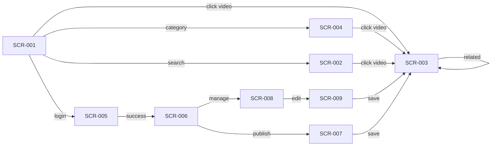
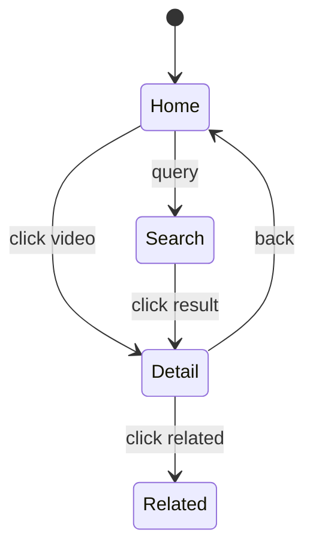
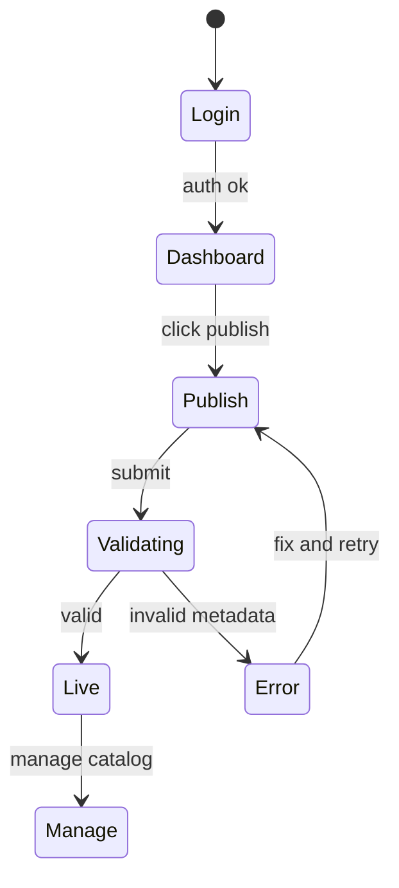

# AppFlow — Tamasha: Application Flow

| Field | Value |
| --- | --- |
| Version | v0.1 |
| Last Updated | 2026-08-06 |
| Owner | Product Designer |
| Status | In Review |

---

## 1. Screen Inventory

| ID | Screen | Purpose | Entry | Exit | Auth |
| --- | --- | --- | --- | --- | --- |
| SCR-001 | Home / Feed | Browse curated videos | / | Search, detail, login | N |
| SCR-002 | Search Results | Show matches | search bar | Detail, filters | N |
| SCR-003 | Video Detail | Watch + metadata | feed/search | Related, back | N |
| SCR-004 | Category Browse | Filtered listing | nav | Detail | N |
| SCR-005 | Login / Register | Authenticate | nav | Dashboard, back | N |
| SCR-006 | Creator Dashboard | Stats overview | nav (creator) | Publish, manage | Y (creator) |
| SCR-007 | Publish Form | Create video | dashboard | Detail (preview) | Y (creator) |
| SCR-008 | Manage Catalog | Edit/unpublish/delete | dashboard | Detail, edit | Y (creator) |
| SCR-009 | Edit Video | Modify metadata | manage | Detail | Y (creator) |

## 2. Navigation Map

## 3. Detailed Flow per Journey

### 3.1 Viewing Journey

### 3.2 Publishing Journey

## 4. Empty / Loading / Error States

| Screen | Empty | Loading | Error |
| --- | --- | --- | --- |
| SCR-001 | Empty-state illustration + CTA | Skeleton cards | Banner + retry |
| SCR-002 | "No results for query" | Spinner | Banner |
| SCR-003 | N/A | Player spinner | "Video unavailable" fallback |
| SCR-005 | N/A | Button spinner | Inline form errors |
| SCR-006 | "No stats yet" | Skeleton | Banner |
| SCR-007 | N/A | Upload progress | Field-level errors |
| SCR-008 | "No videos yet" | Skeleton | Banner |

## 5. Edge Cases & Branching Logic

| IF | THEN |
| --- | --- |
| Search query empty | Show trending/curated instead |
| Video embed provider down | Show fallback message + related videos |
| Creator tries to edit another's video | 403 + redirect |
| Upload metadata missing title | Block submit with field error |
| Feed page > 10 | Paginate (cursor or page) |

## 6. Notifications & Re-engagement

- In-app: publish success toast, error toasts.
- Email/push: out of scope for v1 (REQ non-goals).

## 7. Cross-Platform Deltas

- Responsive web only; mobile uses same screens with stacked layout.
- No native apps in v1.

## 8. Related Documents

| Document | Relationship |
| --- | --- |
| [PRD.md](../product/PRD.md) | Journeys traced to user stories |
| [Design.md](Design.md) | Components used per screen |
| [API.md](../technical/API.md) | Endpoints behind each screen |
| [Schema.md](../technical/Schema.md) | Data objects rendered |
