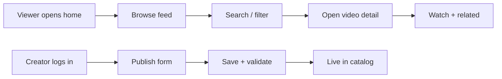

# PRD — Tamasha: YouTube Content Hub & Creator Platform

| Field | Value |
| --- | --- |
| Version | v0.1 |
| Last Updated | 2026-08-06 |
| Owner | Product Manager |
| Status | In Review |

---

## 1. Executive Summary

Tamasha is a content-focused web platform (YouTube integration) where users browse, search, and discover videos while creators publish and manage their content in one place. It combines a polished viewer experience with creator tooling, built on a containerized Python stack (FastAPI/Django-style API + templates/streaming UI) with observability, Docker-based deployment, and reproducible setup. Tamasha targets both casual viewers and independent creators who want a single hub for discovery and publishing.

## 2. Problem Statement

- **User pain:** Video content is scattered; creators juggle multiple tools to publish, track, and present their work; viewers lack a unified discovery surface with clean metadata.
- **Evidence/context:** Content platforms succeed when discovery and publishing are unified; fragmentation costs creators hours per week.
- **Cost of not solving it:** Creators stay on generic platforms with no brand control; viewers miss curated content.

## 3. Goals & Non-Goals

| Goal | Metric | Target |
| --- | --- | --- |
| Unified discovery | Searchable video catalog with rich metadata | 100% of published videos searchable within 5 min |
| Creator efficiency | Time from upload to published | < 5 minutes |
| Platform reliability | API/UI availability | ≥ 99.5% |
| Performance | p95 page load / API latency | < 300 ms |
| Observability | Request + error logging coverage | 100% of requests |

**Non-Goals (v1):**

- No live streaming or video transcoding pipeline (external video hosting / YouTube embed).
- No monetization/payments.
- No native mobile apps (responsive web only).
- No multi-language localization.

## 4. Target Users & Personas

| Persona | Role | Goals | Frustrations | Quote | Tech Level |
| --- | --- | --- | --- | --- | --- |
| Aisha — Casual viewer | Consumer | Discover and watch curated videos | Cluttered generic feeds | "I want a clean place to find good content." | Medium |
| Ravi — Creator | Independent video publisher | Publish, edit metadata, track views | Copy-pasting across tools | "Publishing takes me forever." | Medium |
| Dev — Platform maintainer | Operator | Keep platform healthy | Fragmented services | "I need one dashboard for everything." | High |

## 5. User Stories

| ID | As a... | I want... | So that... | Priority | Acceptance Criteria |
| --- | --- | --- | --- | --- | --- |
| US-001 | Viewer | To browse a curated video feed | I can discover content quickly | P0 | Feed renders top N videos with thumbnails |
| US-002 | Viewer | To search videos by title/tags | I find exactly what I need | P0 | Search returns results < 300 ms |
| US-003 | Viewer | To open a video detail page | I can watch and read metadata | P0 | Detail page embeds player + metadata |
| US-004 | Creator | To publish a video with title, description, tags | My content goes live fast | P0 | Publish flow completes < 5 min |
| US-005 | Creator | To edit or unpublish my video | I can manage my catalog | P1 | Edit/delete with confirmation |
| US-006 | Creator | To see view counts and stats | I understand performance | P2 | Stats panel on dashboard |

## 6. Feature List

**Epic: Viewer Experience**

| ID | Feature | Description | Priority | Status |
| --- | --- | --- | --- | --- |
| REQ-001 | Home feed | Curated, paginated video list | P0 | Planned |
| REQ-002 | Search | Full-text search on title/description/tags | P0 | Planned |
| REQ-003 | Video detail | Player embed + metadata + related | P0 | Planned |
| REQ-004 | Categories/filters | Browse by category | P1 | Planned |

**Epic: Creator Tooling**

| ID | Feature | Description | Priority | Status |
| --- | --- | --- | --- | --- |
| REQ-010 | Publish flow | Create video entry with metadata | P0 | Planned |
| REQ-011 | Manage catalog | Edit, unpublish, delete | P1 | Planned |
| REQ-012 | Creator dashboard | Stats overview | P2 | Planned |
| REQ-013 | Media upload | Upload/attach video asset or embed URL | P1 | Planned |

**Epic: Platform & Ops**

| ID | Feature | Description | Priority | Status |
| --- | --- | --- | --- | --- |
| REQ-020 | Containerized services | Docker compose app + observability | P0 | Planned |
| REQ-021 | Observability stack | Logs, metrics, dashboards | P1 | Planned |
| REQ-022 | Auth | Viewer/creator roles | P1 | Planned |

## 7. User Journeys (high level)

## 8. Success Metrics / KPIs

| Metric | Target | Measurement |
| --- | --- | --- |
| North star: weekly active viewers | +20% MoM | Analytics |
| Time-to-publish (creator) | < 5 min | Form telemetry |
| Search p95 latency | < 300 ms | API logs |
| Video catalog accuracy | 100% searchable | Index check |

## 9. Assumptions & Dependencies

- Video assets hosted externally (YouTube embeds or CDN); Tamasha stores metadata only.
- Python ecosystem with containerized deployment (see docker-compose files).
- Auth requirements minimal for v1 viewer experience; creator roles needed for publishing.
- Observability via bundled stack (e.g., Prometheus/Grafana or ELK, per docker-compose.observability.yml).

## 10. Risks

Top risks from ../project/RiskRegister.md:

1. **Content moderation (R-01):** Unmoderated uploads — mitigate with flag + review workflow.
2. **Search performance (R-03):** Poor indexing at scale — mitigate with proper full-text indexing and caching.
3. **Media dependency (R-05):** External hosting outages — mitigate with health checks and fallback messaging.

## 11. Release Criteria (v1 done)

- [ ] Viewer can browse, search, open, and watch a video end-to-end
- [ ] Creator can publish, edit, and unpublish a video
- [ ] Containerized stack runs with one command; observability configured
- [ ] Search p95 < 300 ms on target dataset size
- [ ] Role-based auth for creator actions
- [ ] Docs suite in sync (API.md, ../technical/Deployment.md, ../technical/Testing.md)

## 12. Open Questions

| # | Question | Owner | Resolve By |
| --- | --- | --- | --- |
| OQ-01 | YouTube embed vs self-hosted video storage for v1? | PM | M1 |
| OQ-02 | Search backend: Postgres FTS vs Elasticsearch? | Eng | M2 |

## 13. Related Documents

| Document | Relationship |
| --- | --- |
| [TechSpec.md](../technical/TechSpec.md) | Architecture and stack |
| [AppFlow.md](../design/AppFlow.md) | Screens and journeys |
| [Design.md](../design/Design.md) | Visual system |
| [Schema.md](../technical/Schema.md) | Data model |
| [ImplementationPlan.md](../project/ImplementationPlan.md) | Phased plan mapping REQs |
| [Tracker.md](../project/Tracker.md) | Live status |
| [Rules.md](../project/Rules.md) | Standards |
| [API.md](../technical/API.md) | Endpoint contracts |
| [SecurityAndCompliance.md](../technical/SecurityAndCompliance.md) | Threat model |
| [Testing.md](../technical/Testing.md) | Test strategy |
| [Deployment.md](../technical/Deployment.md) | Environments/CI-CD |
| [Glossary.md](../reference/Glossary.md) | Vocabulary |
| [RiskRegister.md](../project/RiskRegister.md) | Full risks |
