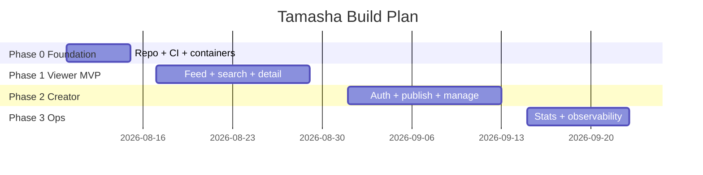
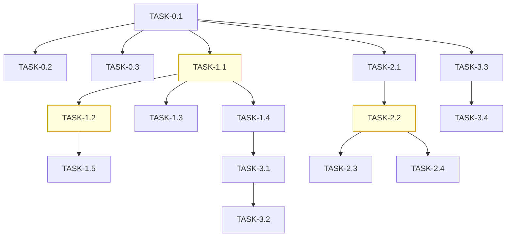

# ImplementationPlan — Tamasha: Phased Build Plan

| Field | Value |
| --- | --- |
| Version | v0.1 |
| Last Updated | 2026-08-06 |
| Owner | Tech Lead |
| Status | In Review |

---

## 1. Build Philosophy

Walking skeleton: browse → search → detail first (viewer MVP), then creator publishing, then ops hardening. Vertical slices with tests per slice.

## 2. Phase Overview

## 3. Phase Breakdown

### Phase 0 — Foundation

**Goal:** Reproducible containers + CI. **Exit:** `make lint && make test` green; `docker compose up` serves app.

| TASK | Description | Depends | Owner | Effort | Maps to |
| --- | --- | --- | --- | --- | --- |
| TASK-0.1 | Compose app + db + cache | — | DevOps | 2d | REQ-020 |
| TASK-0.2 | CI (lint/test/build) | TASK-0.1 | DevOps | 2d | REQ-020 |
| TASK-0.3 | Seed data script | TASK-0.1 | Eng | 1d | REQ-001 |

### Phase 1 — Viewer MVP

**Goal:** Browse, search, watch. **Exit:** Viewer journey complete end-to-end.

| TASK | Description | Depends | Owner | Effort | Maps to |
| --- | --- | --- | --- | --- | --- |
| TASK-1.1 | Video model + migrations | TASK-0.1 | Eng | 2d | TBL-video |
| TASK-1.2 | Feed endpoint + UI | TASK-1.1 | FE | 3d | REQ-001, SCR-001 |
| TASK-1.3 | FTS search | TASK-1.1 | Eng | 3d | REQ-002, SCR-002 |
| TASK-1.4 | Detail page + embed | TASK-1.1 | FE | 3d | REQ-003, SCR-003 |
| TASK-1.5 | Category browse | TASK-1.2 | FE | 2d | REQ-004, SCR-004 |

### Phase 2 — Creator

**Goal:** Publish and manage. **Exit:** Creator can publish end-to-end.

| TASK | Description | Depends | Owner | Effort | Maps to |
| --- | --- | --- | --- | --- | --- |
| TASK-2.1 | Auth + roles | TASK-0.1 | Eng | 3d | REQ-022, SCR-005 |
| TASK-2.2 | Publish form + API | TASK-2.1 | FE/Eng | 3d | REQ-010, SCR-007 |
| TASK-2.3 | Edit/unpublish/delete | TASK-2.2 | Eng | 2d | REQ-011, SCR-008/009 |
| TASK-2.4 | Media upload/embed attach | TASK-2.2 | Eng | 2d | REQ-013 |

### Phase 3 — Ops

**Goal:** Stats + observability. **Exit:** Dashboards live; stats visible.

| TASK | Description | Depends | Owner | Effort | Maps to |
| --- | --- | --- | --- | --- | --- |
| TASK-3.1 | Stats worker | TASK-1.4 | Eng | 3d | REQ-012, TBL-stats |
| TASK-3.2 | Dashboard UI | TASK-3.1 | FE | 2d | SCR-006 |
| TASK-3.3 | Observability stack | TASK-0.1 | DevOps | 3d | REQ-021 |
| TASK-3.4 | Load test + perf gate | TASK-3.3 | DevOps | 2d | NFR-01 |

## 4. Dependency Graph

## 5. Environment & Tooling Setup Checklist

- [ ] Clone; copy `.env.example` → `.env`
- [ ] `docker compose up -d` (app, db, cache)
- [ ] `docker compose -f docker-compose.observability.yml up -d`
- [ ] `make migrate && make seed`
- [ ] Verify `make lint && make test`

## 6. Rollout Strategy

- Feature flags: `SEARCH_ENABLED`, `STATS_ENABLED`, `PUBLISH_ENABLED`.
- Canary 10% on search index changes.
- Migrations run before deploy; rollback = previous image + down migration.

## 7. Definition of Done (global)

- [ ] Tests pass; lint clean
- [ ] Docs updated (API.md/../technical/Schema.md if changed)
- [ ] Accessibility checked (UI tasks)
- [ ] Tracker.md updated
- [ ] PR ≤ 400 lines unless justified

## 8. Related Documents

| Document | Relationship |
| --- | --- |
| [PRD.md](../product/PRD.md) | REQ IDs traced |
| [AppFlow.md](../design/AppFlow.md) | SCR IDs traced |
| [Schema.md](../technical/Schema.md) | TBL IDs traced |
| [Tracker.md](Tracker.md) | Live status |
