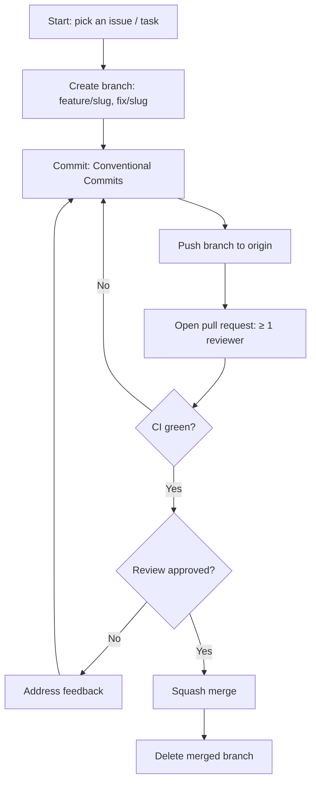

# Rules — Tamasha: Coding Standards & AI-Agent Operating Rules

| Field | Value |
| --- | --- |
| Version | v0.1 |
| Last Updated | 2026-08-06 |
| Owner | Staff Engineer |
| Status | Approved (pending review) |

---

## 1. Guiding Principles

1. **Content-first UX** — never let chrome outrank content.
2. **Readability over cleverness.**
3. **No silent failures** — every error is logged.
4. **Small PRs** ≤ 400 lines.
5. **Tests protect contracts** — API + data migrations tested.
6. **Migrations are sacred** — never edit applied migrations.
7. **Security by default** — auth on creator routes; validate all input.

## 2. Code Style

- **Language:** Python 3.9+ (backend); JS/TS as used in templates/SPA.
- **Lint/format:** ruff + black-compatible; prettier for JS.
- **Naming:** snake_case (py), camelCase (JS components), descriptive.
- **Structure:**

```
Tamasha/
├── app/                 # Backend app package
│   ├── api/             # Routers/views
│   ├── models/          # ORM models
│   └── services/        # Business logic
├── web/                 # Frontend assets/templates
├── migrations/          # DB migrations
├── tests/
├── docker-compose*.yml
└── render.yaml
```

## 3. Git Workflow

- Branches: `feature/<slug>`, `fix/<slug>`.
- Commits: Conventional Commits.
- PRs: ≥ 1 reviewer, CI green, squash merge.
- Never commit `.env`, secrets, or large media assets.

## 4. Testing Requirements

- Coverage ≥ 80% on services + API routes.
- MUST test: auth/roles, publish idempotency, search, delete cascades.
- Optional: UI smoke via Playwright.

## 5. AI Agent Operating Rules

- Read Tracker.md + ImplementationPlan.md before tasks.
- Never mark 🟢 without tests passing.
- Never invent requirements; flag ambiguity.
- Update ../technical/Schema.md with any migration.
- Never commit secrets (SecurityAndCompliance.md).
- Cross-check ../design/Design.md for UI work.
- State rule conflicts rather than silently choosing.

## 6. Security Baseline Rules

- Validate all input; parameterized queries only (no raw SQL concat).
- Password hashing with argon2/bcrypt.
- Role checks on every creator endpoint (server-side, not UI-only).
- Secrets via env vars; dependency scan monthly.

## 7. Documentation Rules

- API change → update ../technical/API.md same PR.
- Migration → update ../technical/Schema.md same PR.
- New screen → update ../design/AppFlow.md inventory + nav map.

## 8. Prohibited Patterns

| Pattern | Why |
| --- | --- |
| `except: pass` | Hides failures |
| Raw SQL string concat | Injection risk |
| Client-side-only auth | Bypassable |
| Committing media/uploads to git | Repo bloat |
| Editing applied migrations | Breaks history |

## 9. Escalation Rules

**Ask a human:** content moderation decisions, GDPR deletion requests, breaking schema changes.
**Decide autonomously:** refactors with tests, bug fixes within contracts, adding metrics.

## Git / PR Workflow



## 10. Related Documents

| Document | Relationship |
| --- | --- |
| [Testing.md](../technical/Testing.md) | Enforcement |
| [SecurityAndCompliance.md](../technical/SecurityAndCompliance.md) | Full baseline |
| [API.md](../technical/API.md) | Contract change triggers |
