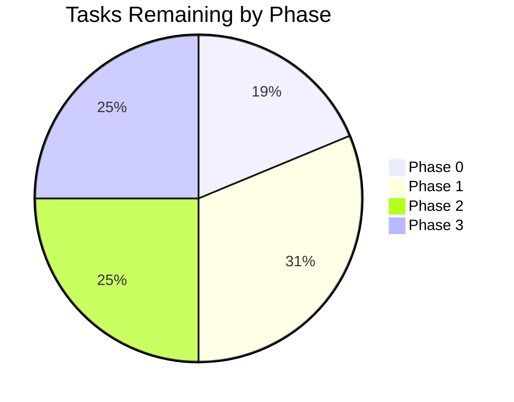

# Tracker — Tamasha: Living Status Tracker

| Field | Value |
| --- | --- |
| Version | v0.1 |
| Last Updated | 2026-08-06 |
| Owner | Tech Lead |
| Status | Active |

---

## 1. Snapshot Dashboard

| Metric | Value |
| --- | --- |
| Overall % Complete | 0% |
| Current Phase | Phase 0 — Foundation |
| Tasks Done / Total | 0 / 17 |
| Blockers (open) | 0 |
| Days to Target Launch | 60 |

## 2. Status Legend

🟢 Done | 🟡 In Progress | 🔴 Blocked | ⚪ Not Started | 🔵 In Review

## 3. Phase Progress Bars

| Phase | Progress |
| --- | --- |
| Phase 0 — Foundation | [░░░░░░░░░░] 0% |
| Phase 1 — Viewer MVP | [░░░░░░░░░░] 0% |
| Phase 2 — Creator | [░░░░░░░░░░] 0% |
| Phase 3 — Ops | [░░░░░░░░░░] 0% |

## 4. Full Task Table

| TASK | Description | Status | Assignee | Start | Target | Actual | Notes |
| --- | --- | --- | --- | --- | --- | --- | --- |
| TASK-0.1 | Compose app+db+cache | ⚪ | DevOps | — | 08-14 | — | — |
| TASK-0.2 | CI | ⚪ | DevOps | — | 08-18 | — | — |
| TASK-0.3 | Seed data | ⚪ | Eng | — | 08-19 | — | — |
| TASK-1.1 | Video model + migrations | ⚪ | Eng | — | 08-25 | — | — |
| TASK-1.2 | Feed endpoint + UI | ⚪ | FE | — | 08-28 | — | — |
| TASK-1.3 | FTS search | ⚪ | Eng | — | 09-02 | — | — |
| TASK-1.4 | Detail page | ⚪ | FE | — | 09-05 | — | — |
| TASK-1.5 | Category browse | ⚪ | FE | — | 09-08 | — | — |
| TASK-2.1 | Auth + roles | ⚪ | Eng | — | 09-12 | — | — |
| TASK-2.2 | Publish form + API | ⚪ | FE/Eng | — | 09-15 | — | — |
| TASK-2.3 | Edit/unpublish/delete | ⚪ | Eng | — | 09-18 | — | — |
| TASK-2.4 | Media attach | ⚪ | Eng | — | 09-22 | — | — |
| TASK-3.1 | Stats worker | ⚪ | Eng | — | 09-26 | — | — |
| TASK-3.2 | Dashboard UI | ⚪ | FE | — | 09-29 | — | — |
| TASK-3.3 | Observability stack | ⚪ | DevOps | — | 10-02 | — | — |
| TASK-3.4 | Load test | ⚪ | DevOps | — | 10-06 | — | — |

## 5. Blockers Log

| ID | Description | Raised | Owner | Impact | Status |
| --- | --- | --- | --- | --- | --- |
| — | None | — | — | — | — |

## 6. Changelog

- 2026-08-06: **Documentation suite complete** — 14-file suite consolidated into `docs/`, categorized structure, cross-linked navigation, deployment/git/auth diagrams, quality gate passed (238/238), merged to `main`.
- 2026-08-06: Documentation suite generated (14 files).

## 7. Burndown Summary

## 8. Next 3 Priorities

1. TASK-0.1 — compose stack up.
2. TASK-1.1 — video model + migrations.
3. TASK-0.3 — seed data.

## 9. Related Documents

| Document | Relationship |
| --- | --- |
| [ImplementationPlan.md](ImplementationPlan.md) | Task source |
| [PRD.md](../product/PRD.md) | Priorities |
| [RiskRegister.md](RiskRegister.md) | Schedule risks |
