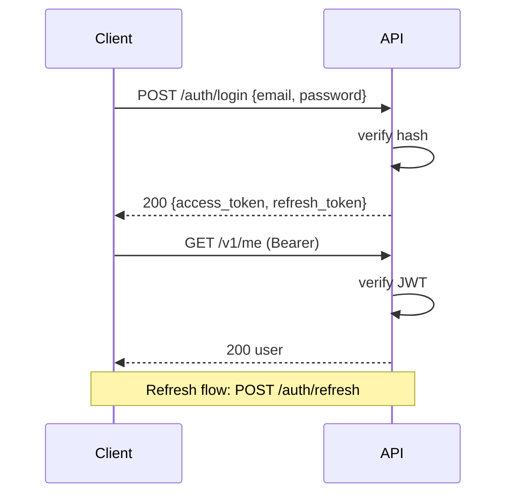

# API — Tamasha: API Reference

| Field | Value |
| --- | --- |
| Version | v0.1 |
| Last Updated | 2026-08-06 |
| Owner | Backend Engineer |
| Status | In Review |

Base URL (dev): `http://localhost:8000` · Versioning: `/v1`.

## 1. Endpoint Summary

| Method | Path | Auth | Purpose |
| --- | --- | --- | --- |
| GET | /v1/videos | N | Feed/paginated listing |
| GET | /v1/videos?q= | N | Search |
| GET | /v1/videos/{id} | N | Detail |
| GET | /v1/categories | N | List categories |
| GET | /v1/categories/{slug}/videos | N | Category browse |
| POST | /v1/auth/login | N | Login |
| POST | /v1/auth/register | N | Register |
| GET | /v1/me | JWT | Current user |
| POST | /v1/videos | JWT creator | Publish |
| PATCH | /v1/videos/{id} | JWT creator (owner) | Edit |
| DELETE | /v1/videos/{id} | JWT creator (owner) | Unpublish/delete |
| GET | /v1/me/stats | JWT creator | Creator stats |

## 2. Auth

- JWT bearer tokens; access 15 min, refresh 7 days.
- Roles: viewer (default), creator, admin. Creator endpoints require role + ownership.

## 3. Endpoint Details

### GET /v1/videos

```json
// 200
{ "items": [ { "id": "v1", "title": "My First Vlog", "thumbnail_url": "...", "view_count": 1240, "creator": "Ravi" } ], "next_cursor": "abc" }
```

| Code | Meaning |
| --- | --- |
| 200 | OK |
| 400 | Bad params |
| 500 | E500_INTERNAL |

### POST /v1/videos

```json
// Request
{ "title": "My First Vlog", "description": "...", "embed_url": "https://youtu.be/abc", "tags": ["vlog"], "category_id": "c1" }
// 201
{ "id": "v1", "status": "draft", "published_at": null }
```

Idempotency: `Idempotency-Key` header; replay returns original 201.

| Code | Meaning |
| --- | --- |
| 201 | Created |
| 400 | E400_VALIDATION — missing title / bad URL |
| 401 | Missing/invalid token |
| 403 | Not a creator |

### PATCH /v1/videos/{id}

| Code | Meaning |
| --- | --- |
| 200 | Updated |
| 403 | Not owner |
| 404 | Not found |

### DELETE /v1/videos/{id}

- Soft delete (status=unpublished) by default; `?hard=true` for owner/admin.

### GET /v1/me/stats

```json
{ "total_views": 1240, "videos": 12, "daily": [ { "day": "2026-09-01", "views": 214 } ] }
```

## 4. Auth Flow



## 5. Rate Limits & Versioning

- 120 req/min per IP (read); 30 req/min (write).
- Breaking change → `/v2`; additive → minor. Deprecation ≥ 3 months.

## 6. Related Documents

| Document | Relationship |
| --- | --- |
| [TechSpec.md](TechSpec.md) | Implementation |
| [Schema.md](Schema.md) | Table mapping |
| [SecurityAndCompliance.md](SecurityAndCompliance.md) | JWT + roles policy |
| [Testing.md](Testing.md) | Contract tests |
