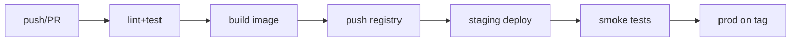
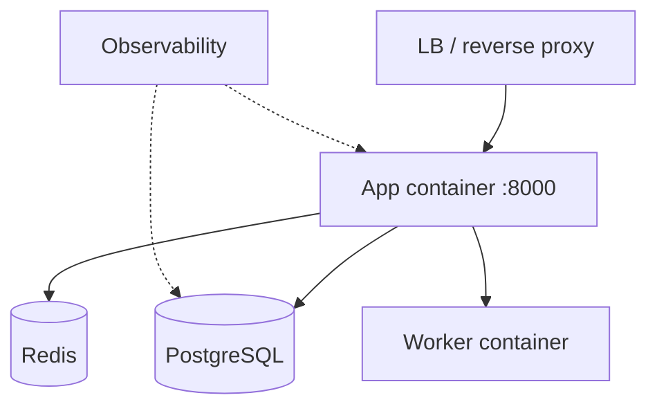

# Deployment — Tamasha: Deployment Guide

| Field | Value |
| --- | --- |
| Version | v0.1 |
| Last Updated | 2026-08-06 |
| Owner | DevOps Engineer |
| Status | In Review |

---

## 1. CI/CD Pipeline

## 2. Environment Promotion

| Stage | Trigger | Verification |
| --- | --- | --- |
| Dev | manual | docker compose up |
| Staging | merge main | smoke + seed check |
| Prod | git tag | health + canary |

## 3. Deployment Topology

- Services: `app`, `worker`, `db`, `cache` in docker-compose.yml.
- Observability stack in docker-compose.observability.yml (Prometheus/Grafana or ELK).
- Render support via render.yaml (web + worker + postgres).

## 4. Rollback Procedure

1. Identify bad release (alert/metrics).
2. Redeploy previous image tag.
3. Run down-migration if schema changed (best-effort).
4. Verify smoke + search + publish.
5. Log in ../project/Tracker.md changelog.

## 5. Feature Flag Policy

| Flag | Default | Purpose |
| --- | --- | --- |
| SEARCH_ENABLED | true | FTS search |
| STATS_ENABLED | true | Stats worker + dashboard |
| PUBLISH_ENABLED | true | Creator publish |

- Env vars; redeploy to change (v1).

## 6. On-Call / Runbook

- 5xx spike → check DB/Redis health, deploy history.
- Search latency → check cache hit ratio; scale Redis.
- Queue depth → scale workers; check dead-letter.
- Media embed errors → verify provider; enable fallback UI.

## 7. Related Documents

| Document | Relationship |
| --- | --- |
| [TechSpec.md](TechSpec.md) | Environments matrix |
| [API.md](API.md) | Health endpoints |
| [SecurityAndCompliance.md](SecurityAndCompliance.md) | Incident response |
| [ImplementationPlan.md](../project/ImplementationPlan.md) | TASK-3.x |
