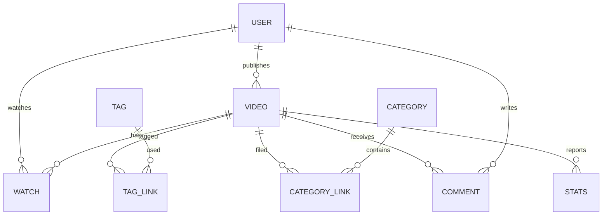

# Schema — Tamasha: Data Model & Database Design

| Field | Value |
| --- | --- |
| Version | v0.1 |
| Last Updated | 2026-08-06 |
| Owner | Data Engineer |
| Status | In Review |

---

## 1. ER Diagram



## 2. Table/Collection Definitions

### TBL-user

| Field | Type | Nullable | Default | Constraints | Description |
| --- | --- | --- | --- | --- | --- |
| id | UUID | N | — | PK | User identifier |
| email | string | N | — | unique | Login email |
| password_hash | string | N | — | bcrypt/argon2 | Credential hash |
| role | enum | N | "viewer" | viewer/creator/admin | Access role |
| display_name | string | N | — | len ≤ 60 | Public name |
| created_at | datetime | N | now() | — | Signup time |

### TBL-video

| Field | Type | Nullable | Default | Constraints | Description |
| --- | --- | --- | --- | --- | --- |
| id | UUID | N | — | PK | Video identifier |
| creator_id | UUID | N | — | FK → TBL-user | Owner |
| title | string | N | — | len ≤ 200 | Title |
| description | text | Y | null | len ≤ 5000 | Description |
| embed_url | string | N | — | valid URL | Playback source |
| thumbnail_url | string | Y | null | valid URL | Thumbnail |
| status | enum | N | "draft" | draft/published/unpublished | Lifecycle |
| view_count | int | N | 0 | ≥ 0 | Denormalized views |
| published_at | datetime | Y | null | — | Go-live time |
| created_at | datetime | N | now() | — | Creation |

### TBL-tag / TBL-tag_link

| Field | Type | Nullable | Default | Constraints | Description |
| --- | --- | --- | --- | --- | --- |
| id (tag) | UUID | N | — | PK | Tag id |
| name (tag) | string | N | — | unique | Tag text |
| video_id (link) | UUID | N | — | FK → TBL-video | Video |
| tag_id (link) | UUID | N | — | FK → TBL-tag | Tag |
| (link PK) | (video_id, tag_id) | N | — | composite | Unique pairing |

### TBL-category / TBL-category_link

Mirror of tag tables: `TBL-category(id, name unique)`, `TBL-category_link(video_id, category_id)`.

### TBL-watch

| Field | Type | Nullable | Default | Constraints | Description |
| --- | --- | --- | --- | --- | --- |
| id | UUID | N | — | PK | Watch id |
| user_id | UUID | N | — | FK → TBL-user | Viewer |
| video_id | UUID | N | — | FK → TBL-video | Video |
| watched_at | datetime | N | now() | — | Timestamp |
| duration_sec | int | N | 0 | ≥ 0 | Seconds watched |

### TBL-comment

| Field | Type | Nullable | Default | Constraints | Description |
| --- | --- | --- | --- | --- | --- |
| id | UUID | N | — | PK | Comment id |
| video_id | UUID | N | — | FK → TBL-video | Target |
| user_id | UUID | N | — | FK → TBL-user | Author |
| body | text | N | — | len ≤ 2000 | Content |
| created_at | datetime | N | now() | — | Time |

### TBL-stats

| Field | Type | Nullable | Default | Constraints | Description |
| --- | --- | --- | --- | --- | --- |
| id | UUID | N | — | PK | Row id |
| video_id | UUID | N | — | FK → TBL-video | Target |
| day | date | N | — | — | Aggregation day |
| views | int | N | 0 | ≥ 0 | Daily views |
| avg_watch_sec | float | N | 0 | ≥ 0 | Avg duration |

## 3. Relationships & Foreign Keys

| From | To | Type | On Delete | Justification |
| --- | --- | --- | --- | --- |
| TBL-video.creator_id | TBL-user | N:1 | Restrict | Preserve history |
| TBL-watch.user_id | TBL-user | N:1 | Cascade | Remove on account delete |
| TBL-watch.video_id | TBL-video | N:1 | Cascade | Remove on video delete |
| TBL-tag_link.* | tag/video | N:1 | Cascade | Orphans cleanup |
| TBL-comment.video_id | TBL-video | N:1 | Cascade | Remove with video |
| TBL-stats.video_id | TBL-video | N:1 | Cascade | Stats die with video |

## 4. Indexes

| Table | Index | Columns | Type | Reason |
| --- | --- | --- | --- | --- |
| TBL-video | ix_video_status_pub | status, published_at | composite | Feed query |
| TBL-video | ix_video_search | title (FTS) | GIN | Search |
| TBL-video | ix_video_creator | creator_id | btree | Creator catalog |
| TBL-watch | ix_watch_user | user_id, watched_at | composite | History |
| TBL-stats | ix_stats_video_day | video_id, day | composite | Stats rollup |

## 5. Enums / Constants

| Field | Allowed Values |
| --- | --- |
| user.role | viewer, creator, admin |
| video.status | draft, published, unpublished |

## 6. Data Lifecycle

- Retention: watch/comment data 24 months; stats aggregated forever; soft-delete users (GDPR hard delete on request).
- Soft delete videos (status=unpublished) before hard delete.

## 7. Migrations Strategy

- Alembic (SQLAlchemy) or Django migrations depending on stack; naming `NNNN_desc`; rollback via down migration; each migration maps to a PR.

## 8. Sample Records

```json
{
  "user": { "id": "u1", "email": "ravi@example.com", "role": "creator", "display_name": "Ravi" },
  "video": { "id": "v1", "creator_id": "u1", "title": "My First Vlog", "status": "published", "view_count": 1240 },
  "watch": { "user_id": "u2", "video_id": "v1", "duration_sec": 180 },
  "stats": { "video_id": "v1", "day": "2026-09-01", "views": 214 }
}
```

## 9. Data Validation Rules

| Field | Enforced In | Rule |
| --- | --- | --- |
| video.embed_url | App + DB | Must be valid http(s) URL |
| video.title | App | 1–200 chars |
| user.email | DB | unique, valid format |
| watch.duration_sec | App | ≥ 0 |
| comment.body | App | 1–2000 chars |

## 10. Sensitive Data Map

| Field | Sensitivity | Encrypt at Rest | Mask Logs |
| --- | --- | --- | --- |
| user.email | PII | Yes (volume) | Yes |
| password_hash | Credential | Yes (hash) | N/A |
| watch history | PII (possible) | Yes | Yes |
| video/comment bodies | Public content | No | No |

## 11. Related Documents

| Document | Relationship |
| --- | --- |
| [API.md](API.md) | Endpoints touching these tables |
| [TechSpec.md](TechSpec.md) | DB engine + FTS choice |
| [SecurityAndCompliance.md](SecurityAndCompliance.md) | PII handling |
