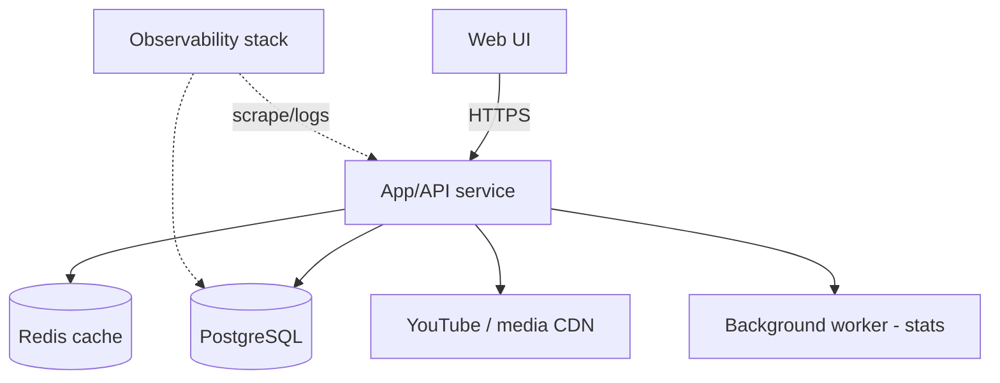
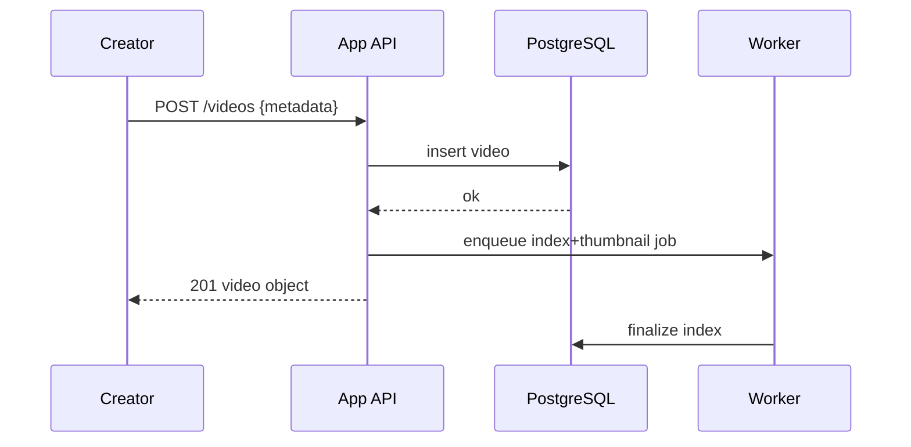
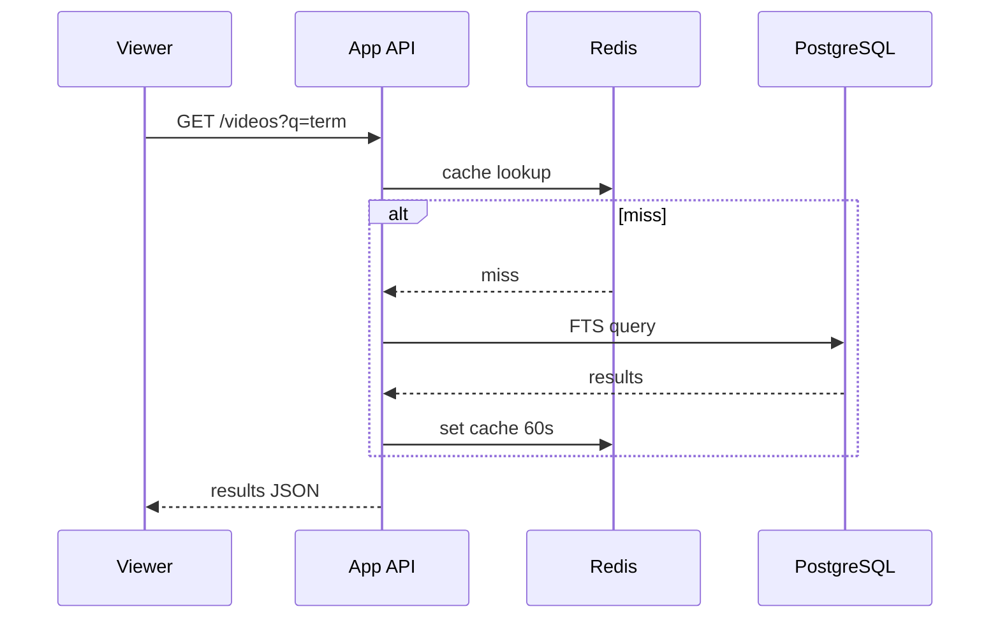
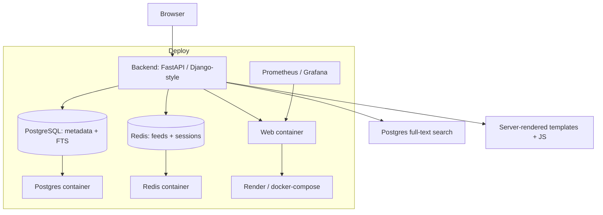

# TechSpec — Tamasha: Technical Specification

| Field | Value |
| --- | --- |
| Version | v0.1 |
| Last Updated | 2026-08-06 |
| Owner | Staff Engineer |
| Status | In Review |

---

## 1. Architecture Overview

## 2. Tech Stack Table

| Layer | Technology | Justification |
| --- | --- | --- |
| Backend | Python (FastAPI or Django-style) | Fast, typed, familiar ecosystem |
| DB | PostgreSQL | Relational metadata, FTS search |
| Cache | Redis | Feed caching, session |
| Frontend | Server-rendered templates + JS (or SPA per repo code) | Fast first paint, SEO-friendly |
| Search | Postgres full-text (v1) | No extra service; upgrade path to ES |
| Observability | Prometheus/Grafana (or ELK) | docker-compose.observability.yml |
| Deployment | Docker + docker-compose + Render support | render.yaml present |
| Quality | ruff, pytest, pre-commit | Consistent, tested |

## 3. System Components

| Component | Responsibility | Inputs/Outputs | Scaling | Failure Modes |
| --- | --- | --- | --- | --- |
| App service | Serve UI + REST API | HTTP → JSON/HTML | Horizontal replicas | DB down → 503 |
| PostgreSQL | Catalog, users, stats | SQL → rows | Vertical + read replicas | Disk full |
| Redis | Cache feed/search | KV → values | Cluster | Cache miss fallback to DB |
| Worker | Async stats/notifications | Queue → jobs | Worker pool | Retry with backoff |
| Media provider | Host video assets | URL embeds | External | Embed fallback message |

## 4. Data Flow Diagrams

### 4.1 Video Publish

### 4.2 Search

## 5. Third-Party Integrations

| Service | Purpose | Failure Fallback | Cost | Rate Limits |
| --- | --- | --- | --- | --- |
| YouTube embed | Video playback | "Video unavailable" message | Free | Embed limits |
| (Optional) Media CDN | Hosted assets | Health-checked redirect | Pay-as-you-go | CDN SLA |
| Sentry (optional) | Error tracking | Log fallback | Free tier | — |

## 6. Non-Functional Requirements

| Category | Requirement | Target | How Verified |
| --- | --- | --- | --- |
| Performance | p95 API latency | < 300 ms | Load test |
| Availability | Uptime | ≥ 99.5% | Uptime monitor |
| Scalability | Concurrent users | ≥ 1,000 | Load test |
| Security | No secrets in code | 0 | pre-commit scan |
| Observability | Request coverage | 100% | Log review |

## 7. Environments

| Env | URL Pattern | Data | Deploy Trigger | Access |
| --- | --- | --- | --- | --- |
| Dev | localhost:8000 | Seed/sample | Manual | Local |
| Staging | staging.tamasha.app | Sample subset | Merge to main | Team |
| Prod | tamasha.app | Full | Tagged release | Public |

## 8. Error Handling Strategy

- Error codes: `E400_*`, `E401_*`, `E404_*`, `E500_*`.
- Retry/backoff on worker jobs (exponential, max 5).
- Idempotency keys on publish to prevent duplicate videos.
- Circuit breaker on media provider calls (fail fast to fallback).

## 9. Observability

- Structured JSON logs (request id, path, latency, user role).
- Metrics: request rate, latency histogram, search latency, worker queue depth.
- Dashboards: App Health, Search Performance, Queue Depth.
- Alerts: 5xx > 1% for 5 min; p95 > 500 ms for 10 min.

## 10. Technical Risks & Mitigations

| Risk | Mitigation |
| --- | --- |
| Search degrades with catalog growth | FTS indexes + cache; upgrade path to ES |
| Media embed outages | Health checks + graceful fallback UI |
| Duplicate publishes | Idempotency keys on POST |
| Queue backpressure | Worker autoscaling + dead-letter queue |

## Deployment Topology

## 11. Related Documents

| Document | Relationship |
| --- | --- |
| [PRD.md](../product/PRD.md) | Requirements implemented |
| [Schema.md](Schema.md) | DB design |
| [API.md](API.md) | Endpoint contracts |
| [Deployment.md](Deployment.md) | docker-compose topology |
| [SecurityAndCompliance.md](SecurityAndCompliance.md) | Threat model |
