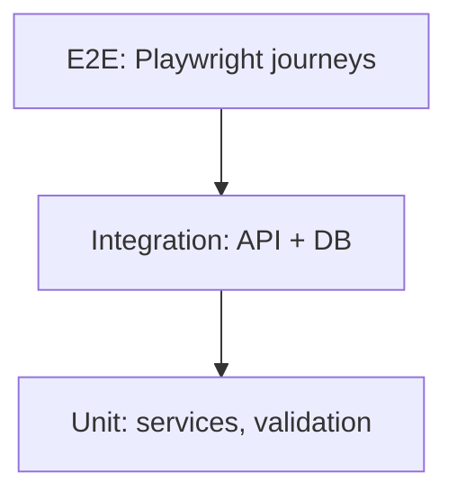

# Testing — Tamasha: Test Strategy

| Field | Value |
| --- | --- |
| Version | v0.1 |
| Last Updated | 2026-08-06 |
| Owner | QA Engineer |
| Status | In Review |

---

## 1. Test Pyramid

- Unit ~60% · Integration ~30% · E2E ~10%.

## 2. Unit Strategy

| Area | Cases |
| --- | --- |
| Validation | Title length, URL format, comment length |
| Services | Publish idempotency, role checks |
| Stats | Aggregation correctness |

## 3. Integration Strategy

| Area | Cases |
| --- | --- |
| Auth | Login/register/refresh; role enforcement |
| Videos | CRUD + ownership + soft/hard delete |
| Search | FTS ranking, pagination |
| Cascades | Delete video → watch/comments/stats cleanup |

## 4. Critical Test Cases per Feature

| Feature | Case | Expected |
| --- | --- | --- |
| Feed | Pagination beyond page 1 | next_cursor works |
| Search | Query matches tag | Result includes tagged video |
| Publish | Duplicate with idempotency key | Single row created |
| Detail | Deleted video id | 404 |
| Stats | Daily rollup | Sums match watch table |
| Auth | Viewer hits publish | 403 |

## 5. Test Data Strategy

- Seeded fixtures (users, videos, tags) via `make seed --test`.
- Random but seeded; per-test transactions rolled back.

## 6. CI Gates

| Gate | Command | Blocking |
| --- | --- | --- |
| Lint | `make lint` | Yes |
| Test | `make test` | Yes |
| Coverage | ≥ 80% core | Yes |
| Deps audit | pip-audit | Yes |

## 7. Related Documents

| Document | Relationship |
| --- | --- |
| [Rules.md](../project/Rules.md) | Requirements (Section 4) |
| [API.md](API.md) | Contracts under test |
| [ImplementationPlan.md](../project/ImplementationPlan.md) | Task gates |
